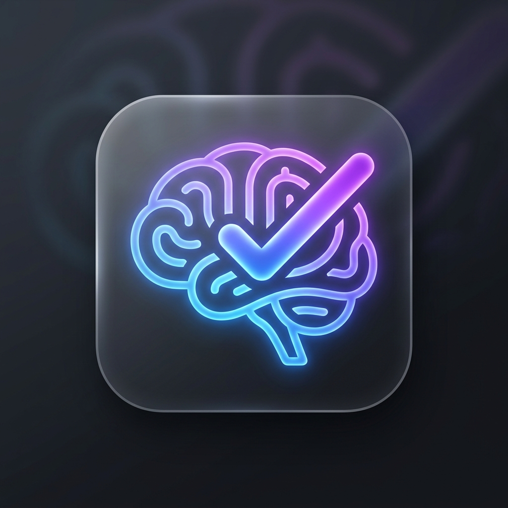

<div align="center">
  
  <h1>心流专注助手 (FlowMind)</h1>
  <p><b>一个具备纸质温度的极简主义全栈“专注作战系统”</b></p>
  <p>
    
    
    
    
    
  </p>
</div>

---

## ✨ 项目简介

**FlowMind 心流专注助手** 是一个专为追求深度工作（Deep Work）与心流状态设计的全栈专注管理系统。

新版本彻底重构了 UI/UX，告别了冰冷的电子毛玻璃感，转而采用**具有“纸质温度”的侘寂风（Wabi-Sabi / Warm Minimalist）有机现代设计**：
- **温暖护眼的纸张底色** (`#f4f0e8`) 搭配**深邃的森林墨绿** (`#174f3f`)；
- **原生 Canvas 微光粒子系统**，为你的专注空间提供若隐若现的视觉呼吸感；
- **全系统零第三方 UI 库依赖**，完全由原生 HTML5、CSS Grid/Flexbox 和 Vanilla JS 纯手工雕琢。

---

## 🚀 四步走心流构建机制 (Core Workflow)

FlowMind 围绕科学的“进入-维持-复盘”心流周期，设计了四个紧密相扣的专注步骤：

### 📡 Step 1. 任务雷达 (Task Radar)
- **低阻力快速收集**：支持输入具体动作，并提供“学习、工作、创作、生活”四个维度分类。
- **精力维度评估**：引入“深度专注、中等精力、轻量处理”三档精力损耗评估，帮助你在状态不佳时先从轻量任务起步。

### 🎯 Step 2. 深度冲刺 & 专注协议 (Deep Sprint & Focus Contract)
- **仪式感检查单 (Rituals)**：内置“水面在手边”、“手机远离视线”、“只保留必要窗口”等专注仪式检查，通过物理准备唤醒心流。
- **专注准备度评估 (Readiness Score)**：动态计算当前专注准备度得分（0% - 100%）。
- **防御墙与奖励机制**：填写本轮防守重点（最怕被什么打断）与完成后的奖赏（去喝水、站立活动），在心理上设立屏障。
- **高级番茄钟**：优雅 of SVG 环形渐变进度条，支持 15/25/45 分钟预设及滑动微调。

### 📥 Step 3. 走神收纳 & 状态教练 (Distraction Storage & State Coach)
- **闪念防干扰收纳**：在专注倒计时中，任何脑海中闪过的“杂念”（如：去拿快递、回个微信）可以随时打入收纳盒，保护心流不被打断。
- **走神转化为任务**：复盘时可一键将收集到的“走神闪念”转化为正式的待办任务或直接归档。
- **状态教练 (State Coach)**：后台根据你的今日专注总时长、干扰率、深度任务占比，动态给予人性化的专注建议和针对性的休息指引。

### 📊 Step 4. 节奏热力与今日复盘 (Rhythm Heatmap & Review)
- **专注热力图**：主打 GitHub 风格的周/日专注时段热力格子，直观展现你最近 7 天的精力和节奏波动。
- **结构化冲刺历史**：自动记录每轮专注的数据（包括该轮的准备度、走神次数、抵御防线和自我奖励）。
- **日记复盘**：提供富文本输入框用于写下今日反思，支持一键导出排版精美的文字报告到剪贴板。

---

## 🛠️ 技术栈

- **前端 (Frontend):** 原生 HTML5, Vanilla JavaScript (ES6+), 原生 CSS3 (CSS Variables, Flexbox/Grid 现代响应式布局)
- **后端 (Backend):** Node.js, Express.js 框架
- **数据层 (Data Layer):** 基于文件系统的本地 JSON 数据库 (0 依赖，极致跨平台)
- **底层 API:** Web Audio API (手写数字信号处理模拟白噪音), HTML5 Canvas 动画, LocalStorage 离线同步

---

## 📦 如何在本地运行

### 前置要求
- 确保你的电脑上安装了 [Node.js](https://nodejs.org/) (推荐 18.x 或以上版本)

### Windows 用户（最快捷）
1. 双击项目根目录下的 **`一键启动.bat`**。
2. 它会自动帮你拉起浏览器并启动 Node 后端服务器。

### 命令行手动启动（所有平台）
1. 打开终端并进入项目目录，安装依赖：
   ```bash
   npm install
   ```
2. 启动开发服务器：
   ```bash
   npm run start
   ```
3. 在浏览器中打开 [http://localhost:3000/focus.html](http://localhost:3000/focus.html) 开启专注体验。

---

## 🎨 界面预览

*有机质感的复古现代暖色调 UI、流畅的微小动画，完美兼容各类主流浏览器。*

> **开发者留言**：此项目是我通过 Vibe Coding 模式独立设计与开发的全栈作品，展示了对原生 Web 性能优化、手写 Web Audio 信号处理、以及现代 UI/UX 侘寂美学的综合实践能力。
